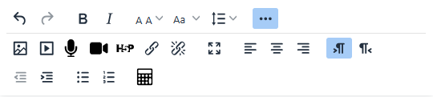
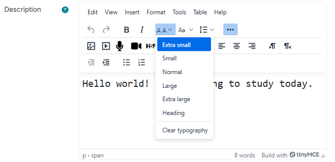
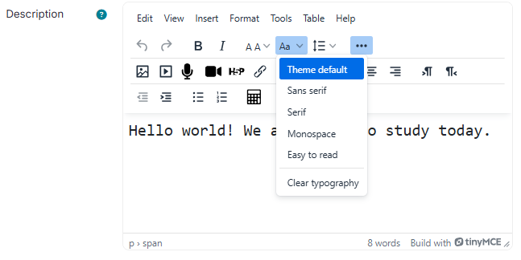
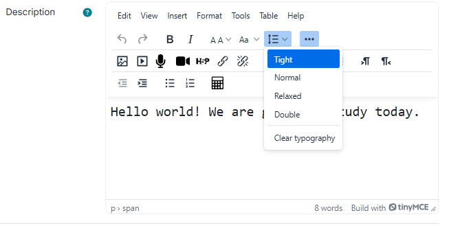
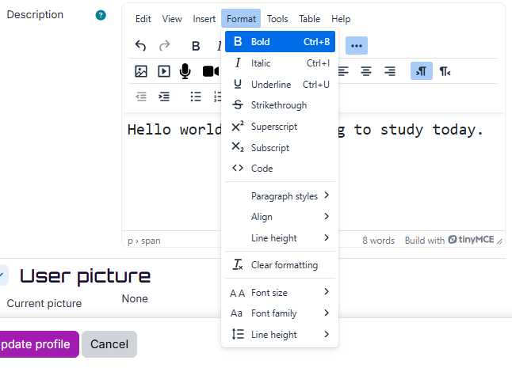
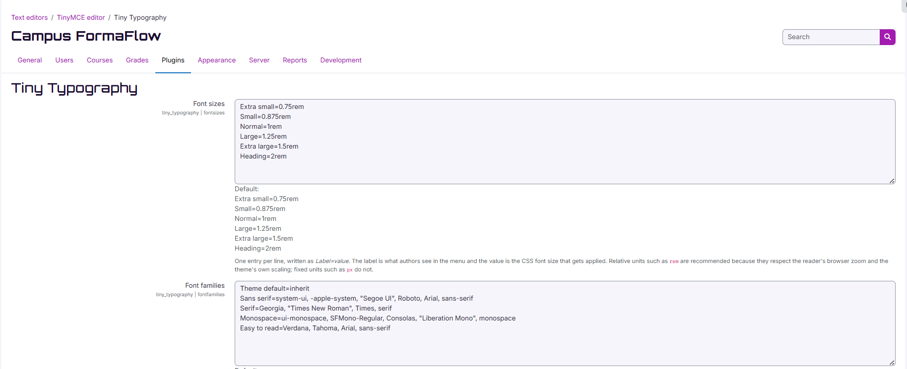
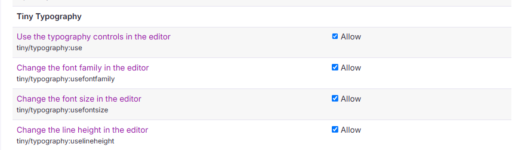

# Tiny Typography

Font size, font family and line height controls for the Moodle TinyMCE editor — in a single plugin, free, GPL, with no licence key.

A [FormaFlow](https://www.formaflow.es) plugin, written by [Rocio Fernandez Peral](https://rociofperal.com).



## Why this exists

Moodle's TinyMCE editor deliberately hides the font controls. In `lib/editor/tiny/amd/src/editor.js`, core strips them out of the Format menu:

```js
// Remove fontfamily for now.
.replace(/fontfamily ?/, '')

// Remove fontsize for now.
.replace(/fontsize ?/, '')
```

So a fresh Moodle gives an author no way to change the size or the typeface of a piece of text. Line height survives in the Format menu, but only with TinyMCE's built-in numeric values (`1`, `1.1`, `1.2` …) and no way for an administrator to change that list.

Restoring the missing controls currently means installing a separate plugin for each one, and the actively maintained versions of some of them sit behind a paid licence key.

Tiny Typography puts the three controls authors actually ask for into one plugin, with the defaults set the way an accessibility-conscious site would want them.

## What it gives you

**A font size picker with a named scale.** Teachers do not know whether they want 14 or 16 pixels. They know they want "Large".



**A font family picker limited to the list the administrator approves**, with a "Theme default" entry first so authored content matches the rest of the site instead of drifting away from it.



**A line height picker on the toolbar**, with named steps and an administrator-configurable list — the control every author looks for after pasting from Word.



**Clear typography** in every picker, which removes what the pickers applied and leaves the rest of the formatting alone.

The font size and font family pickers are added to the Format menu as well, next to the entries Moodle removed. The line height entry TinyMCE already provides is left where it is and fed the administrator's configured values, so the menu and the toolbar button always offer the same list.



## What makes it different

- **Relative units by default.** The shipped scale uses `rem`, so text still responds to the reader's browser zoom and to the theme's own scaling. Fixed `px` sizes break both. You can configure `px` if you need to.
- **Follows the site theme.** The font family list ships with `Theme default=inherit`.
- **Named values, not numbers.** Authors pick "Large" and "Relaxed", not `1.25rem` and `1.75`.
- **Per-control capabilities.** Font size, font family and line height are three separate capabilities, so a site can allow one and lock the others. Controls the user is not allowed to use are never registered, and if none are allowed the plugin's JavaScript is not loaded at all.
- **No licence key, no external services, no personal data.**

## Requirements

Moodle 4.5 or later, with the TinyMCE editor enabled. Continuous integration runs against Moodle 4.5 LTS, 5.0 and 5.2, on both PostgreSQL and MariaDB.

## Installation

Install the ZIP from *Site administration → Plugins → Install plugins*, or unpack the folder into `lib/editor/tiny/plugins/typography` inside your Moodle directory (`public/lib/editor/tiny/plugins/typography` on Moodle 5.0 and later) and then visit *Site administration → Notifications*.

The buttons appear in the editor toolbar on their own. Nothing else to configure to get started.

## Settings

*Site administration → Plugins → Text editors → TinyMCE editor → Tiny Typography*



Each of the three lists is a plain textarea with one entry per line, written as `Label=value`:

```
Small=0.875rem
Normal=1rem
Large=1.25rem
```

The label is what authors see; the value is the CSS that gets applied. Lines without a separator are ignored rather than shown broken.

The three lists ship as language strings rather than as hard-coded values, so the labels a site starts with are translated along with the rest of the plugin.

## Capabilities

- `tiny/typography:use` — use the typography controls at all
- `tiny/typography:usefontsize`
- `tiny/typography:usefontfamily`
- `tiny/typography:uselineheight`

All four are granted to students, teachers, editing teachers and managers by default, and can be overridden at category or course level. Deny one and that picker simply does not appear.



## Privacy

The plugin stores no personal data. It reads the site configuration and nothing else.

## Roadmap

- Import the configured lists from `tiny_fontsize` and `tiny_fontfamily` so sites can switch over without retyping anything.
- Normalise pasted content — turn the spread of pixel sizes that arrives from Word into the configured scale.
- Minimum font size guard for accessibility.
- PHPUnit and Behat coverage.

## Building the JavaScript

The files in `amd/build` are compiled with Moodle's own grunt task and committed, so the plugin works as shipped. If you change anything under `amd/src`, rebuild from the root of a Moodle checkout that contains this plugin:

```
npx grunt amd --root=public/lib/editor/tiny/plugins/typography
```

Do not edit the built files by hand.

## Licence

GNU GPL v3 or later, the same licence as Moodle itself.

## Support

Issues and feature requests: <https://github.com/rociofperal/moodle-tiny_typography/issues>

## Author

Written by Rocío Fernández Peral — <https://rociofperal.com>

Maintained by **FormaFlow** — <https://www.formaflow.es>
